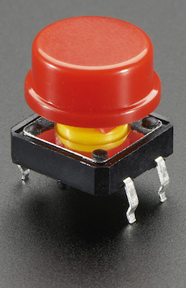
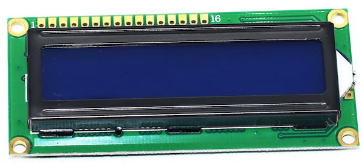
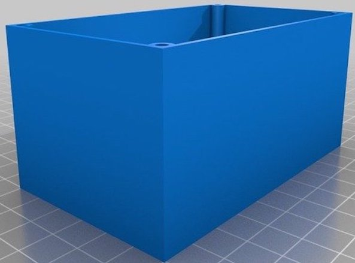
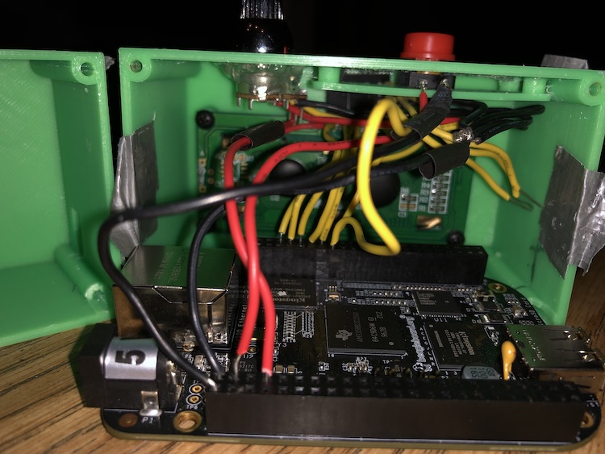
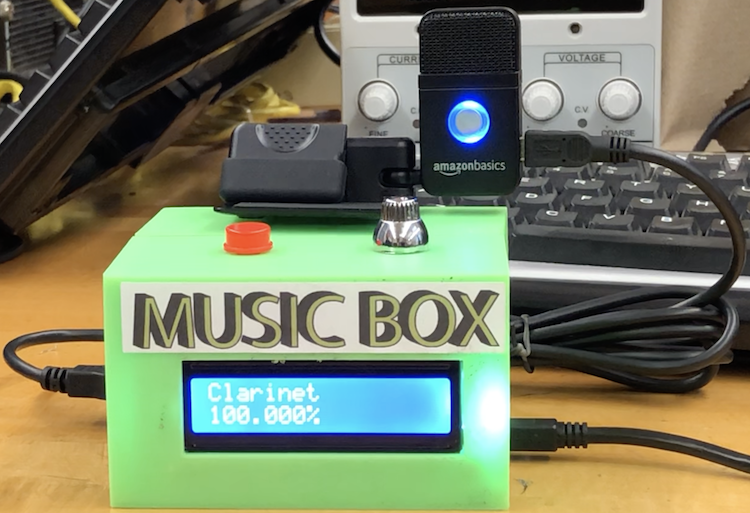

# Embedded Machine Learning

The Music Box is the embedded version of a musical instrument
classification model running on an embedded microprocessor in real-time.
The software is able to receive input with an integrated button, record
audio clips using an integrated mic, and display the resulting classification
in seconds with an integrated LCD screen. This is all housed neatly in a 3D
printed case.

## Table of Contents
* [Hardware](#hardware)
  - [Post Wiring](#finished)
* [Software](#software)
* [Built With](#built)
* [Authors](#authors)

## Hardware
* The Beagle Bone Black (BBB) was utilized as this projects embedded platform.

* A tactile button was integrated for user input.

* A microphone was integrated for audio input.

* A 1602A LCD screen was integrated for user output.

* A 3D Printed case was made to house the components

### Post Wiring 

* This is the result of soldering all the components to the BBB
  - Inside:
  - 
  - Outside:
  - 

## Software

## Built With

* [Dropwizard](http://www.dropwizard.io/1.0.2/docs/) - The web framework used
* [Maven](https://maven.apache.org/) - Dependency Management
* [ROME](https://rometools.github.io/rome/) - Used to generate RSS Feeds

## Authors
* **Daniel Salazar**
  - Hardware Analysis, Integration, and Soldering
  - 3D Printing
  - LCD Software
  - Machine Learning model selection, analysis, and training/testing
  
* **Thomas Martin**
  - Mic Software
  - Audio Preprocess Software
  - Button Software
  - Conversion of Machine Learning model to the embedded version and
  training/testing
## License

This project is licensed under the MIT License - see the [LICENSE.md](LICENSE.md) file for details

## Acknowledgments

* Hat tip to Adafruit for providing the hardware driver code
* Thanks to [Rodger Doering](http://www.csueastbay.edu/directory/profiles/engr/doeringroger.html)
for his insight into the intricacies of Digital Signal Processing.
* Thanks to [Inés  Thiebaut](https://www.csueastbay.edu/directory/profiles/mus/thiebautines.html)
for her insight into Musical Instrument Classification.
